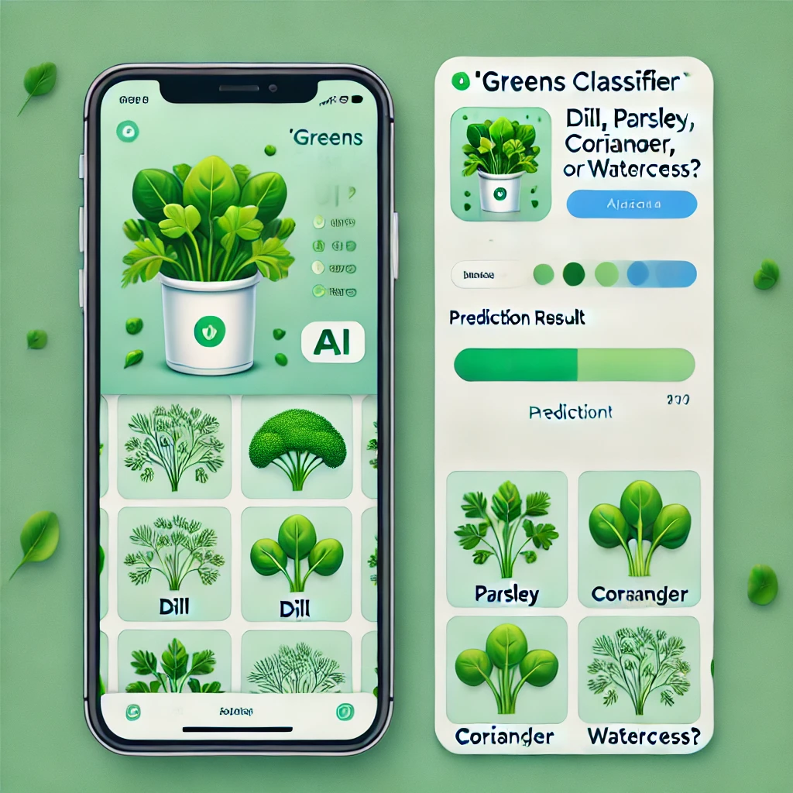
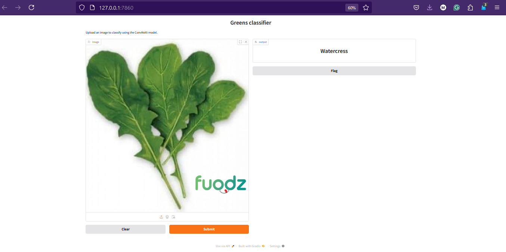

# Greens




## Problem Description

Many young people struggle to distinguish between common greens like Dill, Parsley, Coriander, and Watercress, often feeling shy to ask. Misidentifying them can lead to cooking mishaps or even dietary mistakes.

Greens Classifier is here to help! 📸✨ Just snap a picture, and our model will instantly tell you what green it is. No more confusion—just fun, learning, and perfectly seasoned dishes!

## Objective:

The Greens Classifier aims to make identifying herbs effortless and fun! 🌿✨ Using machine learning, this tool accurately classifies Dill, Parsley, Coriander, and Watercress from images. Whether you're a cooking enthusiast, a curious learner, or someone who just wants to avoid mix-ups, this project provides a simple, instant solution.

Empower yourself with knowledge—one leaf at a time! 🍃📸
## About data

For this project, I curated and compiled my own dataset by gathering images from the internet. To ensure accessibility and reproducibility, I have uploaded the dataset to Kaggle. 
Check it out on Kaggle and explore the greens with me! 🌿📊

The dataset used in this project is available on Kaggle: [Projects Dataset](https://www.kaggle.com/datasets/mahmoudyasser/green-herbs)
follow the notebook steps to download and discovery
```shell
pip install kaggle


```
Obtain Kaggle API Credentials:

``` shell
1- Log in to your Kaggle account.
2- Go to My Account and scroll to the API section.
3- Click Create New API Token to download the kaggle.json file.

```
Copy your kaggle.json to the project path
``` shell
chmod 600 kaggle.json
kaggle datasets download -d mahmoudyasser/green-herbs
unzip green-herbs.zip
```
## To download my training covnext model
``` shell
import gdown
file_id = "15VdFsCglzw_mDNLx7Pdcmp01pjarpIHH"
url = f"https://drive.google.com/uc?id={file_id}"
output = "model.zip"
gdown.download(url, output, quiet=False)
```
``` shell
# then run in terminal

unzip model.zip
```

## Install run app
``` shell
pip install -r requirements.txt
python app.py
```


## Run docker app

``` shell
docker build -t greens-classifier .
docker run -p 7860:7860 greens-classifier
```

## 🚀 Deployment

I am deploying Greens Classifier on Hugging Face Spaces to make it accessible to everyone! 🌿✨

You can check out the live application here:
🔗 [**Greens Classifier on Hugging Face**](https://huggingface.co/spaces/Mahmoud22/Greens?logs=container)  

    ⚠ Note: The deployment is still in progress. Stay tuned for updates!
